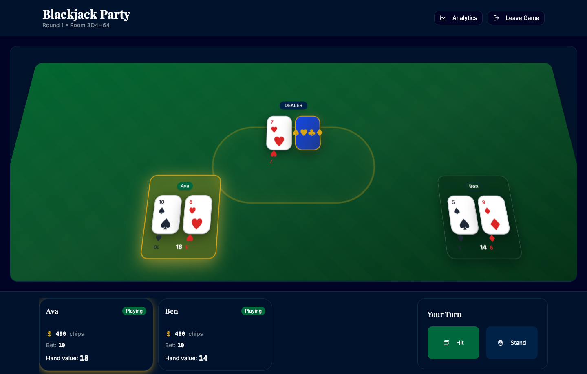

# Blackjack Party

Bring the table to the browser: a polished blackjack game with a cinematic felt table, local hot-seat play, Spark-backed online rooms, and an analytics panel for the end of the hand.

[Play Blackjack Party](https://blackjack-party--sbolel.github.app) | [Run locally](#local-development) | [Architecture](./docs/architecture.md) | [Contributing](./CONTRIBUTING.md) | [Security](./SECURITY.md)

> Spark app visibility is controlled outside this repository. If the play link is not public yet, use the local development flow below.



## Why Play

- **Cinematic table feel:** green felt, card animations, dealer space, player seats, and a focused action panel.
- **Local hot-seat rounds:** sit two to four players around one browser and play through betting, hitting, standing, dealer resolution, and resets.
- **Spark-backed online rooms:** create or join rooms with Spark KV-backed state for lightweight browser multiplayer.
- **Built-in analytics:** open the analytics panel to inspect game stats and betting history.
- **Casual only:** no real-money gambling, wagering, payouts, or gambling-service integrations.

## Local Development

Use Node 24, matching [`.nvmrc`](./.nvmrc):

```sh
nvm use
```

Install dependencies:

```sh
npm install
```

For a clean CI-like install, use `npm ci` instead of `npm install`.

Start the app locally:

```sh
npm run dev
```

Build the app:

```sh
npm run build
```

Run the release validation gate:

```sh
npm run validate
```

Run the Playwright QA smoke test against the local preview build:

```sh
npm run qa:local
```

The Playwright config builds the app and serves it from `http://localhost:3000` by default. Override that with `HOST`, `PORT`, `PLAYWRIGHT_BASE_URL`, or `PLAYWRIGHT_CHANNEL` when needed.

`npm run qa:local` stubs Spark runtime and KV requests inside `tests/e2e/local-hot-seat.spec.ts`, so the local hot-seat smoke test does not require live Spark authentication.

## Project Shape

Blackjack Party is a browser-based React/Vite game. The current playable flow lives primarily in `src/App.tsx`, with supporting UI components in `src/components/` and game logic in `src/lib/`.

For implementation notes, see [docs/architecture.md](./docs/architecture.md). For release tracking, see [docs/release-readiness.md](./docs/release-readiness.md).

## Known Limitations

- Requires the Spark runtime and Spark KV APIs for online room state.
- Spark hosting, publish, and visibility settings are operator steps and should be verified before announcing a public app URL.
- Multiplayer conflict handling is intentionally described conservatively until hardened.
- The pure blackjack engine in `src/lib/engine.ts` is present but not yet the main runtime path.
- The package is marked `private: true`; release readiness currently means GitHub repository and Spark app readiness, not npm publishing.

## Contributing

See [CONTRIBUTING.md](./CONTRIBUTING.md) for setup, validation, branch, commit, issue, and pull request guidance.

Please also review [SECURITY.md](./SECURITY.md) before reporting vulnerabilities or security concerns.

## License

MIT. See [LICENSE](./LICENSE).
